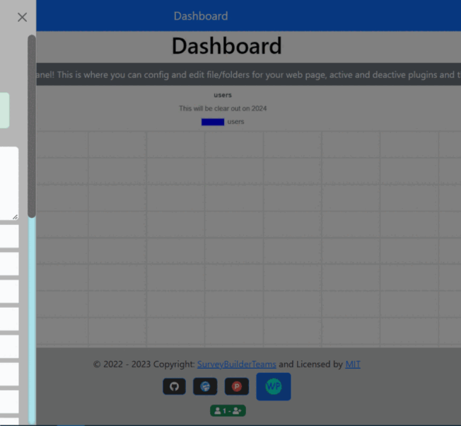

# WebPress

***

### Description

A free open-source CMS(content management system) and forum script that allows you to showcase your website by using a custom made themes and plugins. This also includes easy configuration and easy way to make your own plugins. This uses JSON database (no SQL required) to make it easier to read the database. You can also have collaborations with…
 
 ***
 
 ### Includements
 * Easy _drag-and-drop_ blocks to make your website
 * In-app _mailing server_ (**@webpress.com**).
 * Simple _plugin and theme_ that can be configured and changed.
 * JSON flat-file format
 * Good Security, includes: filehash, over 3 layers of hashing/encryption, easy tracking, function allowabilty.
 * File Management/Editor
 * In-app documentation
 * Custom roles
 * Add toolkit
 * Multiple Language support
 * Custom logo/title
 * SEO tools
 * icon listing
 * in-app fourm
 * Custom DateTime
 * 3 editors (_bbcode, markdown, and WYSIWYG_)
 * Console, shows top _X_ error/warnings you can check for any pervious problems.
 * Sitemap - fixing
 * Feed
 * Mobile friendly
 * Authorization key (_for admin's_)
 ***
 
 ### Info

***

## Showcase

***

## How to install
Download ZIP folder take the `WebPress` Folder and insert it into your **ROOT** folder and go to `{yourdomain}/WebPress`, then click `register` to create account.

**_Note_: First Regsiered account is set to Admin, others will become members**

## Admins/Members/Moderators panels
The panels are the same looks for everyone, but some functions will not be accessable, unlike `admins` the see every tab, where if a `member` would just get a `page not found` error.

***

## support 

This project is supported on multiple servers

This includes `.htaccess` for Apache
* Apache(recommend)
* PHP>=7.4
* GD
* JSON
* mbstring
* openssl
* curl
* zip
* ftp
* fileinfo
***

### updating versions
1. Backup your data so nothing gets destroyed.
2. Delete the "old version" folder entirely.
3. Once done, register a new account for any changes.
4. Reload your data back onto the `data` and `config` folder
(Backups can be done, using the backup plugin)
***

For more documentation:

Go to your dashboard, and click __documentation__

# Other media
[Like on alternativeto.net](https://alternativeto.net/software/webpress/about)

[Upvote on producthunt](https://www.producthunt.com/posts/webpress)
